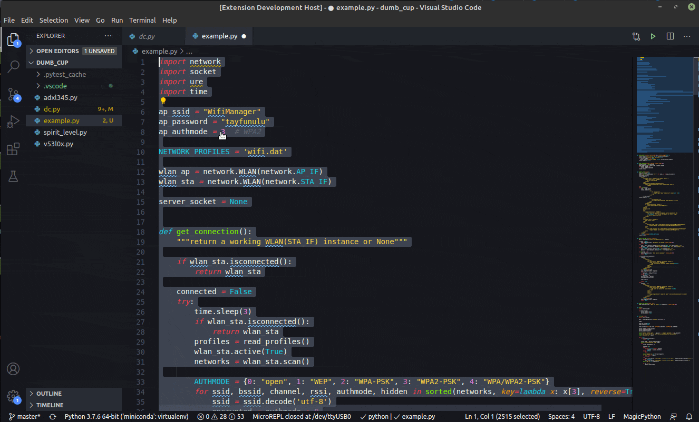
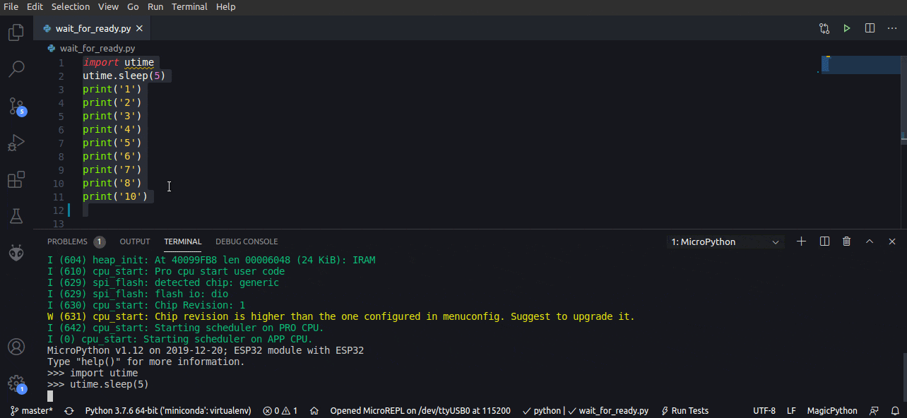
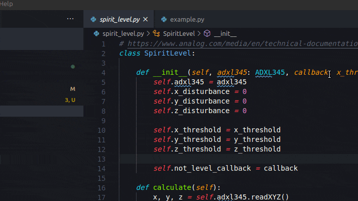

* # micro-python-terminal README

## Features

A robust MicroPython terminal for Visual Studio Code.  Unlike other VSCode extensions for interacting with MicroPython devices, this terminal focuses on an interactive REPL.  And most importantly, no middleware are required to connect the text VSCode editor to the MicroPython REPL.

* Send code directly to MicroPython REPL from VSCode editor

* Real feedback loop.  Code will not execute until REPL is ready.

* Easy to use device selector.

## Requirements

If you have any requirements or dependencies, add a section describing those and how to install and configure them.

## Extension Settings

This extension contributes the following settings:

* `micro-python-terminal.createTerm`: Creates a new integrated terminal, connected to MicroPython device through serial connection.
* `micro-python-terminal.selectDevice`: Lists all connected serial devices and sets the MicroPython device.
* `micro-python-terminal.sendTextTermCommand`: Sends the selected text in the active text editor to the MicroPython REPL.

## Known Issues

None yet.
## Release Notes

Users appreciate release notes as you update your extension.

### 0.0.1
* Send to REPL
* Create MicroPython Terminal
* Select MicroPython USB device
* 82 unit tests

-----------------------------------------------------------------------------------------------------------